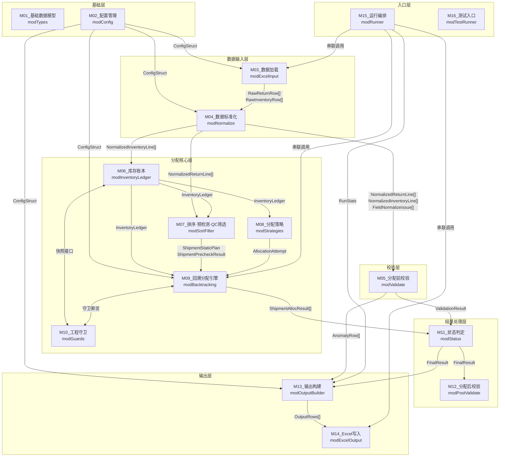

# 退货入库分配系统 — 模块划分方案（第四版）

> **版本说明**：在第三版基础上，修复评审发现的五处接口细节问题：
> 1. **ExpiryIsDate → ExpiryCellKind**：改用 `VarType(cell.Value)` 而非 `IsDate()` 判断单元格类型，避免文本日期绕过字符串级校验
> 2. **原始值保留**：M04 新增 `FieldNormalizeIssue[]` 输出，保留每个非法字段的原始值，供 M05 生成异常明细表的 `RawValue`
> 3. **Dry Run RunStats 来源明确**：M15 新增 `BuildRunStats` 函数，接收 `ValidationResult + AllGroupResults`（干跑时后者为空），统一构造 `RunStats`
> 4. **物流单号级短路编排归属**：M09 新增公开函数 `AllocateShipment`（负责遍历 SKU 组、处理短路和连带回滚），`AllocateSKUGroup` 降为私有函数
> 5. **参数去冗余**：`AllocateSKUGroup` 不再同时传 `rows()` 和 `StaticPlan`，只接收 `StaticPlan`（rows 已在其中）

---

## 总体架构图



> **关键数据契约**：
> - `RawRow`（Variant字段）→ M03 输出，含 `ExpiryCellKind`
> - `NormalizedLine` + `FieldNormalizeIssue[]` → M04 输出，`FieldNormalizeIssue` 保留原始值
> - `ShipmentAllocResult`（含该物流单号所有 SKU 组的 `GroupAllocResult[]`）→ M09 `AllocateShipment` 输出
> - `RunStats` → M15 的 `BuildRunStats` 构造，干跑/完整运行均有效
>
> **VBA 落地说明**：受 VBA `Type` 不能直接承载动态数组等限制，M06/M07/M09/M11 的动态复合结果在现行代码中使用 `Object`（`Scripting.Dictionary`）承载；本方案中的 `ShipmentAllocResult`、`FinalResult` 等名称描述的是数据契约，不表示所有契约都由同名 UDT 直接返回。公开函数的现行参数以本文件各模块说明与源码声明为准。

---

## 模块一览

| 编号 | 模块名称 | VBA文件名 | 核心职责 | 可独立测试 |
|------|---------|-----------|---------|-----------|
| M01 | 基础数据模型 | modTypes | 全系统共用 Type 定义和常量 | 间接 |
| M02 | 配置管理 | modConfig | 读取配置工作表，提供默认值 | 是 |
| M03 | 数据加载 | modExcelInput | 从工作表读取原始行，含 ExpiryCellKind | 是（伪工作表） |
| M04 | 数据标准化 | modNormalize | 纯函数归一化，同时输出 FieldNormalizeIssue[] | 是（强烈推荐）|
| M05 | 分配前校验 | modValidate | E01~E11 四层校验，用 FieldNormalizeIssue 填 RawValue | 是 |
| M06 | 库存账本 | modInventoryLedger | 五元组汇总、扣减、恢复、快照 | 是（核心）|
| M07 | 排序·预检测·QC筛选 | modSortFilter | BuildStaticPlan / RunPrecheck / FilterCandidatePool | 是 |
| M08 | 分配策略 | modStrategies | 策略一/二/三纯算法 | 是 |
| M09 | 回溯分配引擎 | modBacktracking | AllocateShipment（公开）+ AllocateSKUGroup（私有）| 是 |
| M10 | 工程守卫 | modGuards | 库存守恒断言、撤销一致性、E99 | 是 |
| M11 | 状态判定 | modStatus | 接收 ShipmentAllocResult，整单回滚，退单号聚合 | 是 |
| M12 | 分配后校验 | modPostValidate | 验证输出数量守恒、QC一致性 | 是 |
| M13 | 输出构建 | modOutputBuilder | 领域结果→输出行数组（不写Excel） | 是 |
| M14 | Excel写入 | modExcelOutput | 清空+写入+分表+历史追加 | 薄集成测试 |
| M15 | 运行编排 | modRunner | 按钮入口 + BuildRunStats（统一构造运行统计）| 集成测试 |
| M16 | 测试入口 | modTestRunner | RunAllTests，逐字段比对 | 是 |
| M17 | 批量回归扩展 | modBatchTestRunner | RunBatchTestPlan，按批次计划驱动 Excel 回归 | 是 |

`modBatchTestRunner` 于 2026-07-19 拍板为独立模块 **M17**（不并入 M16；M16 保持内存测试入口定位）。

---

## 模块详细说明

### M01 基础数据模型 modTypes

**职责**：定义全系统共用的 VBA `Type` 结构体和常量。按数据生命周期分为四层：原始层、标准化层、问题记录层、领域层。

**对应文档**：§6.2

#### 原始层（M03 输出）

```vba
' 单元格类型常量（用于 ExpiryCellKind，基于 VarType 而非 IsDate）
' M03 读取效期单元格时：
'   VarType(cell.Value) = vbDate(7)   → CELL_KIND_EXCEL_DATE
'   VarType(cell.Value) = vbString(8) → CELL_KIND_TEXT
'   VarType(cell.Value) = vbEmpty(0)  → CELL_KIND_BLANK
'   其他                              → CELL_KIND_OTHER
Public Const CELL_KIND_EXCEL_DATE As String = "ExcelDate"
Public Const CELL_KIND_TEXT       As String = "TextValue"
Public Const CELL_KIND_BLANK      As String = "Blank"
Public Const CELL_KIND_OTHER      As String = "Other"

' 退单表原始行（字段全为 Variant，保留 Excel 原始值）
Type RawReturnRow
    ExcelRowNum  As Long
    ShipmentNo   As Variant
    WMSOrderNo   As Variant
    SKU          As Variant
    LineNo       As Variant   ' 可能是数值 1 或文本 "00001"
    Qty          As Variant   ' 可能是 "abc"、负数、小数
End Type

' 质检库存表原始行
Type RawInventoryRow
    ExcelRowNum   As Long
    ShipmentNo    As Variant
    SKU           As Variant
    QC            As Variant
    LotNo         As Variant
    Expiry        As Variant      ' 原始值（日期序列号 / 文本 / 其他）
    ExpiryCellKind As String      ' 由 VarType(cell.Value) 决定，见上方常量
    Qty           As Variant
End Type
```

> **为什么用 VarType 而不是 IsDate**（修复 P1）：
> VBA 的 `IsDate("2029/01/01")` 对文本字符串也返回 True，会让文本效期误判为日期型，跳过 §2.2 要求的字符串级格式校验（YYYY/MM/DD 或 YYYY-MM-DD 拆分逐段检查），重新引入区域设置风险。
> `VarType(cell.Value)` 返回的是单元格内部存储类型：Excel 识别为日期时存为日期序列号，VarType=vbDate(7)；手工录入文本时 VarType=vbString(8)。以此区分可精确选择解析路径。

#### 标准化层（M04 输出）

```vba
' 标准化后退单行（强类型字段 + 合法性标记）
Type NormalizedReturnLine
    ExcelRowNum      As Long
    ShipmentNo       As String
    WMSOrderNo       As String
    SKU              As String
    LineNo           As String    ' 五位前导零文本，如 "00001"
    Qty              As Long
    LineNoValid      As Boolean
    QtyValid         As Boolean
    EmptyFields      As String    ' 逗号分隔的空字段名，如 "SKU,数量"
End Type

' 标准化后质检库存行
Type NormalizedInventoryLine
    ExcelRowNum      As Long
    ShipmentNo       As String
    SKU              As String
    QC               As String    ' 已 Trim+UCase
    LotNo            As String    ' 已标准化
    Expiry           As String    ' 统一为 YYYY/MM/DD
    Qty              As Long
    QCValid          As Boolean
    ExpiryValid      As Boolean
    QtyValid         As Boolean
    EmptyFields      As String
End Type
```

#### 问题记录层（M04 同时输出，保留原始值供 M05 使用）

```vba
' 单字段标准化问题记录（修复 P1：保留原始值）
' M04 对每个合法性为 False 的字段产生一条，由 M05 用于 ValidationIssue.RawValue
Type FieldNormalizeIssue
    ExcelRowNum  As Long
    SourceTable  As String    ' "退单表" 或 "质检库存表"
    FieldName    As String    ' 如 "行号"、"效期"、"数量"、"QC情况"
    RawValue     As String    ' 原始值的字符串表示（供 §5.4 数据异常明细表输出）
    IssueKind    As String    ' "Empty"（空值）/ "FormatError"（格式非法）/ "RangeError"（范围非法）
End Type
```

#### 领域层（分配核心层使用）

```vba
' 库存五元组键
Type InventoryKey
    ShipmentNo As String
    SKU        As String
    QC         As String
    LotNo      As String
    Expiry     As String
End Type

' 单条分配明细
Type AllocationDetail
    ShipmentNo   As String
    WMSOrderNo   As String
    SKU          As String
    LineNo       As String
    OrderQty     As Long
    QC           As String
    LotNo        As String
    Expiry       As String
    AllocQty     As Long
    LineStatus   As String    ' 批量导入 / 手工操作 / 分配失败
End Type

' 单个 SKU 组的回溯统计（始终产生，不受日志级别影响）
Type GroupStats
    ShipmentNo       As String
    SKU              As String
    BacktrackCount   As Long
    PreCheckHit      As String  ' 空 / "预检测A" / "预检测B"
End Type

' 调试日志事件（仅当 DebugLogLevel ≠ "关闭" 时产生）
Type AllocationEvent
    ShipmentNo       As String
    SKU              As String
    WMSOrderNo       As String
    LineNo           As String
    EventType        As String   ' "分配成功" / "回溯撤销" / "E09" / "E10"
    UsedQC           As String
    StrategyUsed     As String
    BacktrackNo      As Long
    IsRevoked        As Boolean
    IsFinalResult    As Boolean
End Type

' 单个 SKU 组的完整分配结果（M09 私有函数 AllocateSKUGroup 返回）
Type GroupAllocResult
    ShipmentNo   As String
    SKU          As String
    Success      As Boolean
    ErrorCode    As String       ' E09 / E10 / E99 / "连带回滚" / 空
    Stats        As GroupStats   ' 始终有值
    ' Details() As AllocationDetail  — VBA 动态数组，成功时有值
    ' Events()  As AllocationEvent   — VBA 动态数组，日志非关闭时有值
End Type

' 单个物流单号的完整分配结果（M09 公开函数 AllocateShipment 返回）
' 包含该物流单号下所有 SKU 组的 GroupAllocResult，含短路后的连带回滚结果
Type ShipmentAllocResult
    ShipmentNo      As String
    ' GroupResults() As GroupAllocResult — 该物流单号所有 SKU 组，含连带回滚
End Type

' 校验问题（单条）
Type ValidationIssue
    ShipmentNo   As String
    ErrorCode    As String
    ExcelRowNum  As Long
    FieldName    As String
    RawValue     As String   ' 来自 FieldNormalizeIssue.RawValue，由 M05 从 M04 输出中取得
End Type

' 配置结构体
Type ConfigStruct
    MaxBacktrackCount    As Long
    DebugLogLevel        As String   ' 关闭 / 简版 / 详细
    DetailedLogLimit     As Long
    LotCaseSensitive     As Boolean
    NoExpirySentinel     As String
End Type

' 本次运行汇总统计（由 M15 BuildRunStats 统一构造）
Type RunStats
    TotalBacktrackCount  As Long   ' 所有组的回溯次数之和（干跑时=0）
    MaxGroupBacktrack    As Long   ' 单组最高回溯次数（干跑时=0）
    ValidationFailCount  As Long   ' 校验失败的物流单号数
    AllocSuccessCount    As Long   ' 分配成功的物流单号数（干跑时=0）
    AllocFailCount       As Long   ' 分配失败的物流单号数（干跑时=0）
    InputReturnRows      As Long   ' 退单表输入行数
    InputInventoryRows   As Long   ' 质检库存表输入行数
End Type
```

---

### M02 配置管理 modConfig

**职责**：从"配置"工作表读取参数，填充 `ConfigStruct`，处理缺失时使用默认值，校验配置值合法性。

**对应文档**：§6.7.6

**公开函数**：
- `LoadConfig(ws As Worksheet) → ConfigStruct`

**独立测试点**：
- 工作表为空时全部使用默认值
- `最大回溯次数` 为非正整数时报配置错误
- `批号比较模式` 只接受"不敏感"/"敏感"

---

### M03 数据加载 modExcelInput

**职责**：从 Excel 工作表按行读取原始数据，输出 `RawReturnRow[]` 和 `RawInventoryRow[]`。字段全为 `Variant`。唯一的预处理：对效期列使用 `VarType(cell.Value)` 判断单元格存储类型，填入 `ExpiryCellKind`（修复 P1）。

**对应文档**：§2.1、§2.2

**公开函数**：
- `ReadReturnOrders(ws As Worksheet) → RawReturnRow[]`
- `ReadQCInventory(ws As Worksheet) → RawInventoryRow[]`

**不负责**：不做 Trim、不补零、不转类型、不判断合法性。

**ExpiryCellKind 判断规则**（唯一涉及 Excel 对象的判断）：
```
VarType(cell.Value) = vbDate(7)   → CELL_KIND_EXCEL_DATE
VarType(cell.Value) = vbString(8) → CELL_KIND_TEXT
VarType(cell.Value) = vbEmpty(0)  → CELL_KIND_BLANK
其他                               → CELL_KIND_OTHER
```

**独立测试点**：
- 数值型行号（单元格值为 `1`）作为 `Variant` 原样保留
- Excel 日期序列号 → `ExpiryCellKind = "ExcelDate"`，文本 `"2029/01/01"` → `ExpiryCellKind = "TextValue"`
- 效期空单元格 → `ExpiryCellKind = "Blank"`

---

### M04 数据标准化 modNormalize

**职责**：接收 `RawReturnRow[]` 和 `RawInventoryRow[]`，执行字段归一化，同时输出两类结果：
1. `NormalizedReturnLine[]` / `NormalizedInventoryLine[]`（标准化后的强类型行，含合法性标记）
2. `FieldNormalizeIssue[]`（每个非法字段的原始值记录，供 M05 填充异常明细的 RawValue）

**所有函数只接收普通数据类型，不接触 Worksheet/Range 等 Excel 对象。**

**对应文档**：§4.0

**公开函数**：
- `NormalizeReturnRows(raws() As RawReturnRow, cfg As ConfigStruct, outIssues() As FieldNormalizeIssue) → NormalizedReturnLine[]`
- `NormalizeInventoryRows(raws() As RawInventoryRow, cfg As ConfigStruct, outIssues() As FieldNormalizeIssue) → NormalizedInventoryLine[]`

**内部私有函数**（纯函数，输入什么输出什么）：
- `NormalizeLineNo(rawVal As Variant) → (result As String, isValid As Boolean)`
- `NormalizeExpiry(rawVal As Variant, cellKind As String) → (result As String, isValid As Boolean)`
  - `cellKind = "ExcelDate"`：用 `CDate(rawVal)` + `Format(..., "yyyy/mm/dd")`，不做字符串校验
  - `cellKind = "TextValue"`：先做字符串级校验（YYYY/MM/DD 或 YYYY-MM-DD 拆分逐段检查，含闰年），通过后再 `CDate` 转为日期；不通过则 `isValid = False`
  - `cellKind = "Blank"` 或其他：`isValid = False`
- `NormalizeQC(rawVal As Variant) → (result As String, isValid As Boolean)` — Trim→UCase→校验
- `NormalizeLotNo(rawVal As Variant, cfg As ConfigStruct) → String`
- `NormalizeQty(rawVal As Variant) → (result As Long, isValid As Boolean)`
- `NormalizeTextField(rawVal As Variant) → (result As String, isValid As Boolean)`

**独立测试点**：

| 输入 | cellKind | 期望结果 |
|------|---------|---------|
| 数值 `1`（LineNo）| — | `CStr(1)`=`"1"`，不满足"恰好5位且全为数字字符"→ isValid=False；FieldNormalizeIssue.RawValue="1"（§2.1：不自动补零，唯一合法输入为文本型五位前导零字符串） |
| `"0001A"` | — | isValid=False；FieldNormalizeIssue.RawValue="0001A" |
| 日期序列号（Excel内部）| ExcelDate | 正确转 YYYY/MM/DD，不受区域设置影响 |
| `"2029/01/01"` | TextValue | `"2029/01/01"`，isValid=True |
| `"2029-01-01"` | TextValue | `"2029/01/01"`，isValid=True |
| `"2029/02/29"`（非闰年）| TextValue | isValid=False；RawValue="2029/02/29" |
| `"2029/13/01"` | TextValue | isValid=False；RawValue="2029/13/01" |
| `" zp "` | — | `"ZP"`，isValid=True |
| `"QM"` | — | isValid=False；RawValue="QM" |
| `"abc"`（Qty）| — | isValid=False；RawValue="abc" |

---

### M05 分配前校验 modValidate

**职责**：接收 `NormalizedReturnLine[]`、`NormalizedInventoryLine[]` 和 `FieldNormalizeIssue[]`，执行四层校验（E01~E11），收集所有命中错误码，用 `FieldNormalizeIssue.RawValue` 填充 `ValidationIssue.RawValue`（修复 P1：原始值来源明确）。

**对应文档**：§4.1

**公开函数**：
- `ValidatePre(orders() As NormalizedReturnLine, inventory() As NormalizedInventoryLine, issues() As FieldNormalizeIssue, cfg As ConfigStruct, outValidationIssues() As ValidationIssue) → ValidationResult`
  - Layer1：E01~E05（合法性标记 + FieldNormalizeIssue）
  - Layer2：E06、E07
  - Layer3：E08（已命中E04的组跳过）
  - Layer4：E11（已命中E04或E08的组跳过）
- `BuildAnomalyRows(validationIssues() As ValidationIssue) → AnomalyRow[]`

**独立测试点**：
- E04（数量非法）：`ValidationIssue.RawValue = "abc"`，来自 `FieldNormalizeIssue`
- E05（效期非法）：`ValidationIssue.RawValue = "2029/13/01"`，来自 `FieldNormalizeIssue`
- 同一物流单号同时命中 E01 + E04，两个错误码均保留
- E11 只在 `0 < T < groupMinQty` 时触发，T=0 不触发

---

### M06 库存账本 modInventoryLedger ⭐

**职责**：按五元组汇总质检库存，提供统一的库存状态管理接口，是库存状态的唯一持有者。

**对应文档**：§6.2.2、§6.3.1

**公开函数**：
- `BuildLedger(inventory() As NormalizedInventoryLine) → InventoryLedger`
- `QueryQCTotal(ledger, shipNo As String, sku As String, qc As String) → Long`
- `GetFiveTupleRows(ledger, shipNo As String, sku As String, qc As String) → InventoryRow[]`
- `Deduct(ledger, key As InventoryKey, qty As Long, undoLog) → Boolean`
- `Undo(ledger, undoLog)`
- `TakeSnapshot(ledger, shipNo As String, sku As String) → InventorySnapshot`

**独立测试点**：
- 相同五元组多行正确汇总
- 扣减超过剩余量时返回 False，账本不变
- Undo 后账本与扣减前完全一致

---

### M07 排序·预检测·QC筛选 modSortFilter

**职责**：分配前的全部准备工作。三个接口严格分离，禁止共享隐藏状态。

**对应文档**：§4.2.1、§4.2.2、§4.2.3

| 函数 | 生命周期 | 描述 |
|------|---------|------|
| `BuildStaticPlan` | 一次性静态 | 计算初始可用QC数、静态排序 |
| `RunPrecheck` | 一次性预检测 | 预检测A/B，只读不改 |
| `FilterCandidatePool` | 每行动态 | 动态筛选可用QC候选池 |

**公开函数**：
- `BuildStaticPlan(rows() As NormalizedReturnLine, ledger As InventoryLedger) → StaticPlan` — StaticPlan 包含排序后的行数组和每行初始可用QC数
- `RunPrecheck(plan As StaticPlan, ledger As InventoryLedger) → PrecheckResult` — 只返回预检测结论，不修改 plan 或 ledger
- `FilterCandidatePool(currentLineNo As String, plan As StaticPlan, ledger As InventoryLedger, triedQCs() As String) → CandidateRow[]` — 每行分配前调用，不依赖 BuildStaticPlan 的缓存

**独立测试点**：
- `BuildStaticPlan` 和 `FilterCandidatePool` 使用完全相同的 nextMinQty 定义
- 预检测A：静态排序后第一行可用QC=0 时命中
- 预检测B：T=S 时不命中，T≥S+minQtyOther 时不命中
- `FilterCandidatePool` 结果不受 `BuildStaticPlan` 内部缓存状态影响

---

### M08 分配策略 modStrategies

**职责**：在候选池内依次尝试三级策略，返回分配尝试结果（含 undoLog）。只解决"当前行如何从候选池拿到 D 件"，不做回溯，不记日志。

**对应文档**：§4.2.4、§4.2.5

**公开函数**：
- `TryAllocate(pool() As CandidateRow, demand As Long, ledger As InventoryLedger) → AllocationAttempt`
- `CompareByPriority(a As CandidateRow, b As CandidateRow) → Integer`

**内部私有函数**：StrategyOne / StrategyTwo / StrategyThree

**独立测试点**：
- 策略三只在同一QC内拼凑，不跨QC
- 所有策略失败时账本不变（或完整回滚）

---

### M09 回溯分配引擎 modBacktracking

**职责**：提供两层接口（修复 P4）：

- **`AllocateShipment`（公开）**：以物流单号为单位，遍历该物流单号下所有 SKU 组，调用私有 `AllocateSKUGroup` 逐组分配；某组触发 E09/E10/E99 时立即短路，为后续未处理 SKU 组生成 `GroupAllocResult`（ErrorCode="连带回滚"），返回 `ShipmentAllocResult`
- **`AllocateSKUGroup`（私有）**：以单个 SKU 组为单位，管理 choiceStack、attemptedQCsByRow、回溯计数，始终产生 `GroupStats`，按配置可选产生 `AllocationEvent[]`

`AllocateSKUGroup` 只接收 `StaticPlan`（rows 已在其中），不再单独传 `rows()`（修复 P5）。

**对应文档**：§4.2.7、§6.3.1.3

**公开函数**：
- `AllocateShipment(shipNo As String, skuList() As String, planMap As Object, precheckMap As Object, ledger As InventoryLedger, cfg As ConfigStruct) → ShipmentAllocResult`
  - 遍历 `skuList`，对每个 SKU 调用私有 `AllocateSKUGroup`
  - 某 SKU 组返回 E09/E10/E99 → 立即停止，为剩余 SKU 生成连带回滚 `GroupAllocResult`
  - 所有 SKU 组完成后汇总为 `ShipmentAllocResult`

**私有函数**：
- `AllocateSKUGroup(plan As StaticPlan, precheckResult As PrecheckResult, ledger As InventoryLedger, cfg As ConfigStruct) → GroupAllocResult`

**独立测试点**：
- `AllocateShipment` 某 SKU 组 E10 后，后续 SKU 组 `GroupAllocResult.ErrorCode = "连带回滚"`
- `AllocateSKUGroup` 无需回溯时 `GroupStats.BacktrackCount = 0`
- 回溯成功后 target 之后的 attemptedQCsByRow 被清除
- 回溯超过上限触发 E10

---

### M10 工程守卫 modGuards

**职责**：提供运行时强制断言，检验库存账目数学等式成立，任一失败立即触发 E99 停止运行。

**对应文档**：§6.5

**公开函数**：
- `AssertConservation(snapshot As InventorySnapshot, ledger As InventoryLedger, details() As AllocationDetail) → Boolean`
- `AssertUndoConsistency(snapshot As InventorySnapshot, choiceStack, ledger As InventoryLedger) → Boolean`
- `RaiseE99(shipNo As String, sku As String, expected As Long, actual As Long, context As String)`

**独立测试点**：
- 正常扣减恢复不触发
- 人为漏恢复一行时 AssertConservation 触发
- E99 信息包含物流单号、SKU、期望值、实际值

---

### M11 状态判定 modStatus

**职责**：接收 `ShipmentAllocResult[]`（来自M09 `AllocateShipment`）和 `ValidationResult`（来自M05），拥有整单回滚所需的全部信息，执行行级状态判定、整单回滚、退单号状态聚合。

**对应文档**：§4.4

**公开函数**：
- `DetermineLineStatus(details() As AllocationDetail, lineNo As String) → String`
- `ApplyRollback(shipmentResults() As Object, validationResult As ValidationResult, validationIssues() As ValidationIssue, orders() As NormalizedReturnLine) → Object/FinalResult` — 同时处理校验阶段（E01~E11）和分配阶段（E09/E10/E99）的失败原因
- `AggregateWMSStatus(finalResult As FinalResult) → WMSStatusMap`
- `BuildRollbackReason(directCodes() As String, triggerCode As String) → String`

**独立测试点**：
- 校验阶段 E08 失败 → 整单回滚，原因格式正确
- 分配阶段 E10 失败 → 整单回滚，连带 SKU 原因：`整单回滚（触发原因：E10）`
- `ShipmentAllocResult` 中连带回滚的 SKU 组，状态正确聚合

---

### M12 分配后校验 modPostValidate

**职责**：对成功分配的物流单号，验证输出明细与输入数据的一致性。

**对应文档**：§4.3

**公开函数**：
- `ValidatePost(orders() As NormalizedReturnLine, finalResult As FinalResult) → PostValidationResult`

**独立测试点**：
- 某行分配量 ≠ 退单量时失败
- 同一行使用了两种 QC 时失败
- 整单回滚的物流单号不参与后校验

---

### M13 输出构建 modOutputBuilder

**职责**：将所有领域结果转换为输出表的二维数组，不打开也不写入任何 Excel 工作表。

**对应文档**：§5.1-§5.6

**公开函数**：
- `BuildSummaryRows(wmsStatusMap As WMSStatusMap, dryRunMode As Boolean) → OutputRow[]`
- `BuildDetailRows(finalResult As FinalResult) → OutputRow[]`
- `BuildAnomalyOutputRows(anomalyRows() As AnomalyRow) → OutputRow[]`
- `BuildDebugLogRows(events() As AllocationEvent, cfg As ConfigStruct) → OutputRow[]` — events 为空数组时返回空，不崩溃
- `BuildRunHistoryRow(stats As RunStats, cfg As ConfigStruct, dryRunMode As Boolean) → OutputRow` — RunStats 由 M15 构造，干跑/完整运行均有值（修复 P2）

**独立测试点**：
- 干跑模式汇总表不含通过校验的物流单号
- E06/E08/E11 只进汇总表，不进异常明细表
- E07 汇总表 WMS退单号字段填 `[N/A]`
- `BuildDebugLogRows(空数组, cfg)` 返回空数组，不崩溃

---

### M14 Excel写入 modExcelOutput

**职责**：接收 M13 生成的输出行数组，执行 Excel 工作表的清空和写入。只做写入，不计算业务状态。

**对应文档**：§5、§6.7.2-§6.7.4

**公开函数**：
- `ClearOutputSheets(wb As Workbook, cfg As ConfigStruct)`
- `WriteSheet(ws As Worksheet, rows() As OutputRow, headers() As String)`
- `WriteDebugLog(wb As Workbook, rows() As OutputRow, cfg As ConfigStruct)`
- `AppendRunHistory(ws As Worksheet, row As OutputRow)`

**独立测试点**：
- 清空保留表头，不清空输入表/配置表/运行历史
- 调试日志超过阈值时分表，编号连续
- 工作表被保护时中止并提示，不继续运行

---

### M15 运行编排 modRunner

**职责**：两个按钮的实际执行入口，串联模块调用顺序，新增 `BuildRunStats` 统一构造本次运行统计（修复 P2：Dry Run RunStats 来源）。

**对应文档**：§6.7.3-§6.7.5

**公开函数**：
- `RunValidationOnly(wb As Workbook)` — 干跑：清空→加载(M03)→标准化(M04)→校验(M05)→`BuildRunStats`→构建输出(M13)→写入(M14)
- `RunFullAllocation(wb As Workbook)` — 完整：在校验基础上建账本(M06)→排序预检(M07)→分配(M09)→守卫(M10)→状态判定(M11)→后校验(M12)→`BuildRunStats`→构建输出(M13)→写入(M14)
- `BuildRunStats(validationResult As ValidationResult, shipmentResults() As ShipmentAllocResult, orders() As NormalizedReturnLine, inventory() As NormalizedInventoryLine) → RunStats` — 统一构造运行统计；干跑时 `shipmentResults` 传空数组，回溯次数字段均为0，其余字段（校验失败数、输入行数、错误码分布）从 `ValidationResult` 提取

**规则**：
- 干跑模式不调用 M06/M07/M08/M09，传空数组给 `BuildRunStats` 和 M13
- 清空失败时不继续运行
- E99 在此层统一捕获，写入汇总表后终止

---

### M16 测试入口 modTestRunner

**职责**：提供 `RunAllTests()` 自动化测试入口，逐用例调用各模块、与期望输出逐字段比对，输出 PASS/FAIL。

**公开函数**：
- `RunAllTests()` — 执行全部用例
- `RunSingleTest(caseNo As Integer)` — 单用例调试

**验收用例**（§6.5.3 T1~T11+）：

| 用例 | 场景 | 关键验证点 |
|------|------|-----------|
| T1 | 策略一精确匹配 | 行状态=批量导入，BacktrackCount=0 |
| T2 | 策略二最接近匹配 | 剩余库存保留 |
| T3 | 策略三跨批号/效期 | 行状态=手工操作，多条明细 |
| T4 | 多QC竞争+静态排序 | 处理顺序符合预期 |
| T5 | 回溯触发并成功 | choiceStack 正确撤销，终态正确 |
| T6 | 回溯耗尽 E10 | E10触发，整单回滚，连带 SKU 状态=连带回滚 |
| T7 | E11 碎片库存 | E11触发，整单标记失败 |
| T8 | E08 数量不一致 | E08触发，汇总表正确 |
| T9 | 整单回滚（部分SKU失败）| 全部回滚，连带回滚原因格式正确 |
| T10 | E07 孤立物流单号 | WMS退单号字段填 `[N/A]` |
| T11+ | 行号补零、批号大小写、效期哨兵值、ExcelDate序列号、文本日期字符串级校验 | 各规则覆盖 |

---

## 数据流与关键接口汇总

| 发送方 | 接收方 | 传递类型 | 说明 |
|--------|--------|---------|------|
| M02 | M03/M04/M09/M13 | `ConfigStruct` | 配置参数 |
| M03 | M04 | `RawReturnRow[]`、`RawInventoryRow[]`（含 ExpiryCellKind）| Variant字段 |
| M04 | M05 | `NormalizedReturnLine[]`、`NormalizedInventoryLine[]`、`FieldNormalizeIssue[]` | 含合法性标记和原始值 |
| M04 | M06 | `NormalizedInventoryLine[]` | 建账本 |
| M04 | M07 | `NormalizedReturnLine[]` | 排序分组 |
| M05 | M11 | `ValidationResult` | 校验阶段失败信息 |
| M05 | M13 | `AnomalyRow[]` | E01~E05、E07 字段级异常 |
| M06 | M07/M08/M09 | `InventoryLedger`（引用）| 库存账本 |
| M07 | M09 | `ShipmentStaticPlan`、`ShipmentPrecheckResult` | 按物流单号组织的静态计划 |
| M08 | M09（私有调用）| `AllocationAttempt` | 含 undoLog |
| M09 | M10 | 断言函数调用 | 守卫触发则抛 E99 |
| M09 | M11 | `ShipmentAllocResult[]` | 含所有 SKU 组结果（含连带回滚）|
| M11 | M12 | `FinalResult` | |
| M11 | M13 | `FinalResult` | |
| M15 | M13 | `RunStats` | 由 BuildRunStats 构造，干跑/完整均有效 |
| M13 | M14 | `OutputRow[]` | |

---

## 推荐开发顺序

```
阶段1（基础）   M01 → M02
阶段2（输入）   M03 → M04   ← 核心：RawRow→NormalizedLine+FieldNormalizeIssue
阶段3（校验）   M05
阶段4（账本）   M06
阶段5（算法）   M07 → M08 → M09（先写 AllocateSKUGroup 再包一层 AllocateShipment）+ M10
阶段6（结果）   M11 → M12
阶段7（输出）   M13 → M14
阶段8（集成）   M15（含 BuildRunStats）→ M16
```

---

## 与测试用例清单的对应关系

| 用例集 | 对应模块 | 重点场景 |
|--------|---------|---------|
| UT-Normalize | M03+M04 | ExpiryCellKind 三种类型、ExcelDate序列号转换、文本效期字符串级校验、FieldNormalizeIssue 原始值保留 |
| UT-Validation | M05 | E01~E11、跳过规则、RawValue 正确来自 FieldNormalizeIssue |
| UT-Ledger | M06 | 汇总、扣减、撤销、快照、守恒 |
| UT-Candidate | M07 | 静态排序、nextMinQty、动态QC筛选、预检测A/B |
| UT-Strategy | M08 | 策略一/二/三、平局排序、部分扣减 |
| UT-Backtracking | M09+M10 | AllocateShipment短路+连带回滚、AllocateSKUGroup回溯成功/耗尽、GroupStats始终有值 |
| UT-Status | M11 | 行状态、退单号聚合、整单回滚（分配阶段+校验阶段两类触发路径）|
| UT-PostCheck | M12 | 分配后数量守恒、QC一致性 |
| UT-OutputBuild | M13 | 汇总表/明细表/异常表数据构造、干跑差异、RunStats 字段 |
| IT-Runner | M15+M14 | 干跑 BuildRunStats 验证、完整分配、清空输出、调试日志分表 |
| E2E-Acceptance | 全模块 | T1~T10 和 T11+ 验收场景 |
